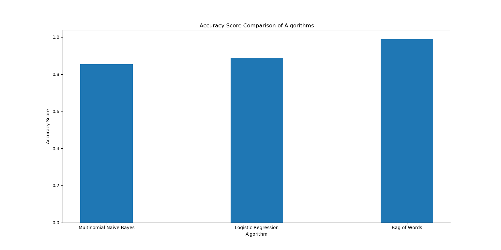
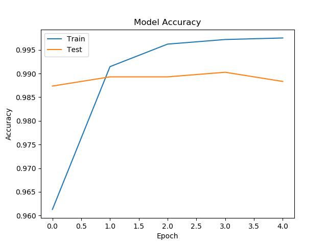
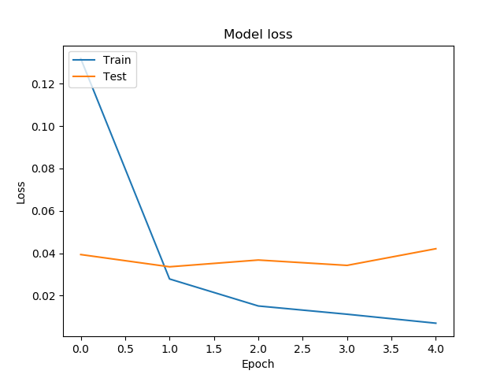

# Tweet Inspector


Online social networks are likewise generally utilized by abusers, for spreading hate or some propaganda about world events or local affairs, politics or religion, interests, affiliations, organizations, products, people. Numerous culprits 'take cover' behind the way that they will most likely be unable to be promptly distinguished, making statements that they wouldn't think about saying eye to eye, which could be viewed as fainthearted. Online maltreatment takes a few structures, and unfortunate casualties are not limited to open figures. They can carry out any responsibility, be of all ages, sex, sexual direction or social or ethnic foundation, and live anyplace. With the growth of social media platforms in the 21st century, it has become necessary for any individual or organization to maintain a good social reputation. Any kind of oppressive and abusive posts against someone can result in the decline of their social reputation. Such abusive posts, in the worst case, can also result in social riots and other events that can harm the peace of a region. This problem needs a good solution. Many social media platforms like Instagram have developed and deployed systems that can detect abusive and hate inducing posts and block the account that they have been posted. But we found that there are no systems or fewer systems that can detect abuses in Indian languages. Hindi being the most popular Indian language, we decided to create a system using machine learning algorithms that can classify tweets in Hindi as abusive and not abusive.


## Implementation

### Dataset used

We have made use of frameworks with python and JavaScript condition to make AI model, front-end/REST-API. We have also made use of a Twitter developer account to gather tweet information through the Twitter API. The twitter API has a breaking point of 300 tweets for every page, so we chose to utilize a [Twitter Scraper](https://github.com/jonbakerfish/TweetScraper) to scratch tweets from twitter. We gathered around 10k tweets in the Devanagari script and created a training and testing set from this set of tweets. The information collection additionally contained the tweet id, user id, twitter handle of the user, number of retweets, number of favorites, number of replies for every single tweet. The legitimacy of information is guaranteed as the tweets are right now accessible on the web and we have utilized the official Twitter API for the reason. 

### Model/Methodology

Firstly the data set was cleaned by removing stop words, special characters, hashtags, punctuations, blanks. As we only needed Hindi tweets, we removed the tweets that contained less than 40% Devanagari characters. Two machine learning models were used namely Multinomial Naïve Bayes and Logistic Regression. To train these models we first created a term frequency-inverse document frequency vector for the data set and fed this tf-idf matrix as input to these algorithms. We also used a deep learning Sequential Model using the Bag of words approach. We created a bag of words for the given data set using Keras Tokenizer and fed it as input to the model. The model has two layers. The first layer has 512 nodes and the second layer has two. Relu activation function has been used in the first layer and the SoftMax activation on the second layer. 


## Testing and Results


The models were tested on the test set derived from the data set described in the previous section. We achieved a pretty good accuracy score for all the algorithms that we used for the classification of abusive tweets. The Multinomial Naïve Bayes Algorithm achieved an accuracy of 81.5% while the Logistic Regression achieved an accuracy score of 85%. The Bag of Words Model using Keras, after 5 epochs, achieved a training accuracy score of 95%. The snapshots of the graphical visualization can be seen below for a better understanding of the output.

**Some Snapshots**








## The Interface

The interface has been created using HTML, CSS on the frontend and Flask at the backend. The web application has been deployed on Heroku and can be accessed [here](https://tweet-inspector-app.herokuapp.com/).

We have also created an Application Programming Interface (API) for the models using Flask that is free to access and can be integrated with any programming language. The API has been designed using the concepts of REST. It accepts the tweet data from the user in JSON format and returns the predictions made by all users in JSON format. 

### Using the API

`
### Using the API

`
The API can be accessed by sending a request to the URL:` `https://tweet-inspector-api-v2.herokuapp.com/predict`

- **API call through curl**

``curl -i -H "Content-Type: application/json" -X POST -d "[{\"text\":\"वे एक संवेदनशील लेखक, सचेत नागरिक, कुशल वक्ता तथा सुधी (विद्वान) संपादक थे\", \"value\": 0}]" https://tweet-inspector-api-v2.herokuapp.com/predict``

- **API call through curl**

```python3
import requests
import json

txt = "वे एक संवेदनशील लेखक, सचेत नागरिक, कुशल वक्ता तथा सुधी संपादक थे"
value = 0
json_inp = json.dumps([{'text': txt, 'value': value}])
r = requests.post("https://tweet-inspector-api-v2.herokuapp.com/predict", data = json_inp, headers = {'Content-Type': 'application/json'})
print(r.json())
```


## THE GUI


